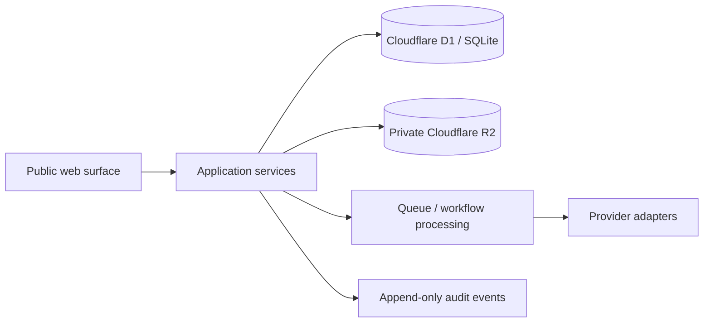

# Architecture

## Status

This architecture is a `scaffolded` foundation derived from the accessible issue statement only. Missing proprietary source materials prevent file-level traceability for several business workflows.

## System shape

## Decision spine

`deal -> evidence -> reviewed facts -> underwriting version -> scenarios -> recommendation -> decision receipt`

## Financing control spine

`financing request -> lender fit -> package version -> authorization -> recipients -> distribution -> response -> term sheet`

## Implemented foundation

- `packages/authorization` enforces default-deny access decisions.
- `packages/underwriting` provides deterministic `bigint`-backed core calculations.
- `migrations/0001_initial.sql` reserves normalized tables for workspaces, deals, documents, financing authorizations, and append-only audit events.
- `packages/schemas` establishes shared status and traceability schemas.

## Deferred surfaces

- `apps/web`: blocked pending branded source assets and UX source package.
- `apps/worker`: scaffolded only.
- Provider adapters: future.
- OCR, malware scanning, AI pipelines, lender distribution: future.
